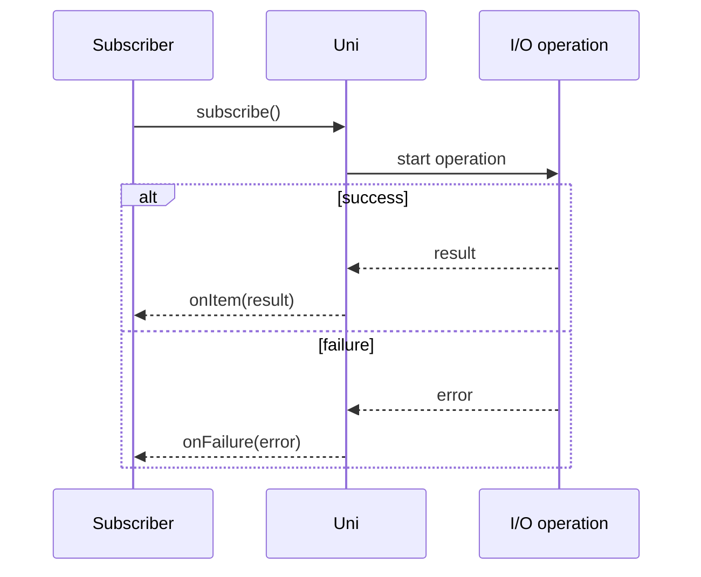

# Uni and Multi

The Mutiny Vert.x bindings replace Vert.x's `Future` and `ReadStream` types with Mutiny's two reactive types: `Uni` and `Multi`.
Understanding these types is essential to working with the bindings.

## What is Uni?

`Uni<T>` represents a **single asynchronous result**: it either emits one item of type `T` or a failure.
It is the Mutiny equivalent of Vert.x's `Future<T>`.

A `Uni` is **lazy**: nothing happens until you subscribe.
Creating a `Uni` merely declares an asynchronous pipeline; the underlying I/O or computation only starts when a subscriber asks for it.



## What is Multi?

`Multi<T>` represents an **asynchronous stream** of items: it can emit zero, one, or many items of type `T`, optionally followed by a completion or failure signal.
It is the Mutiny equivalent of Vert.x's `ReadStream<T>`.

`Multi` supports **back-pressure**: a subscriber controls how many items it is ready to receive, preventing the producer from overwhelming it.

## The three method variants

For every Vert.x method that returns a `Future<T>`, the code generator produces three variants:

| Variant | Signature | Behavior |
|---|---|---|
| Reactive | `Uni<T> method()` | Lazy. Returns a `Uni` that starts the operation on subscription. |
| Blocking | `T methodAndAwait()` | Subscribes and blocks the calling thread until the result arrives. |
| Fire-and-forget | `EnclosingType methodAndForget()` | Subscribes immediately, discards the result, and returns `this` for fluent chaining. |

For example, given a Vert.x method `Future<HttpServer> listen(int port)` on the `HttpServer` class, the generator produces:

```java
Uni<HttpServer> listen(int port);         // reactive
HttpServer listenAndAwait(int port);      // blocking helper
HttpServer listenAndForget(int port);     // fire-and-forget (returns this)
```

Use `methodAndAwait()` in tests and setup code where blocking is acceptable.
Use `methodAndForget()` for one-way operations where you do not need the result.
Prefer `Uni`-returning methods in production reactive pipelines.

## Side-by-side comparison: event bus

=== "Mutiny Bindings"

    ```java
    EventBus bus = vertx.eventBus();

    bus.consumer("address", message -> message.reply("world"))
        .completionAndAwait();

    bus.request("address", "hello")
        .onItem().invoke(reply -> System.out.println(reply.body()))
        .onFailure().invoke(Throwable::printStackTrace)
        .await().atMost(Duration.ofSeconds(10));
    ```

=== "Vanilla Vert.x"

    ```java
    EventBus bus = vertx.eventBus();

    bus.consumer("address", message -> message.reply("world"));

    bus.request("address", "hello")
        .onSuccess(reply -> System.out.println(reply.body()))
        .onFailure(err -> err.printStackTrace());
    ```

With the Mutiny bindings, `request` returns a `Uni<Message<Object>>`.
You compose over it with explicit operators, then subscribe: either by calling `.await()` or `.subscribe().with(...)`.

## Multi from an event bus consumer

A `MessageConsumer` can be turned into a `Multi` of messages.
Each message published or sent to the address becomes an item in the stream:

=== "Mutiny Bindings"

    ```java
    EventBus bus = vertx.eventBus();

    bus.<Integer>consumer("address").toMulti()
        .onItem().transform(Message::body)
        .subscribe().with(body -> System.out.println("Received: " + body));

    bus.send("address", 1);
    bus.send("address", 2);
    bus.send("address", 3);
    ```

=== "Vanilla Vert.x"

    ```java
    EventBus bus = vertx.eventBus();

    bus.<Integer>consumer("address")
        .handler(message -> System.out.println("Received: " + message.body()));

    bus.send("address", 1);
    bus.send("address", 2);
    bus.send("address", 3);
    ```

The `toMulti()` method bridges the Vert.x `ReadStream` into a Mutiny `Multi`.

## Chaining Uni operations

Mutiny encourages explicit operator names that describe what each step does.
Here is an HTTP client pipeline that chains several asynchronous steps:

=== "Mutiny Bindings"

    ```java
    Buffer payload = vertx.createHttpClient()
        .request(HttpMethod.GET, port, "localhost", "/")
        .onItem().transformToUni(HttpClientRequest::send)
        .onItem().transformToUni(HttpClientResponse::body)
        .await().atMost(Duration.ofSeconds(5));
    ```

=== "Vanilla Vert.x"

    ```java
    Buffer payload = vertx.createHttpClient()
        .request(HttpMethod.GET, port, "localhost", "/")
        .compose(HttpClientRequest::send)
        .compose(HttpClientResponse::body)
        .toCompletionStage().toCompletableFuture()
        .get(5, TimeUnit.SECONDS);
    ```

Each operator has a clear role:

- `.onItem().transformToUni(HttpClientRequest::send)`: when the request object arrives, send it and return the response as a new `Uni`.
- `.onItem().transformToUni(HttpClientResponse::body)`: read the response body as another asynchronous step.
- `.await().atMost(Duration.ofSeconds(5))`: block and wait for the final result with a timeout.

The key operators for chaining are:

| Operator | Purpose |
|---|---|
| `.onItem().transform(fn)` | Synchronously transform the item (like `map`). |
| `.onItem().transformToUni(fn)` | Asynchronously transform the item into another `Uni` (like `flatMap`). |
| `.onItem().invoke(fn)` | Perform a side effect without changing the item. |
| `.onItem().call(fn)` | Perform an asynchronous side effect (returns a `Uni<Void>`), then continue with the original item. |
| `.onFailure().invoke(fn)` | Perform a side effect when a failure occurs. |
| `.onFailure().recoverWithItem(fn)` | Replace a failure with a fallback item. |

## Subscription model

A `Uni` does nothing until subscribed.
This is different from Vert.x's `Future`, which represents an already-started operation.

This laziness gives you an important advantage: you can build up a pipeline, pass it around, and decide _when_ to trigger it.
Multiple subscriptions re-execute the pipeline each time, which is useful for retry logic and repeated operations.

=== "Mutiny Bindings"

    ```java
    // Build the pipeline once — nothing happens yet
    Uni<Message<Object>> pipeline = bus.request("address", "hello");

    // Subscribe later, possibly multiple times
    pipeline.subscribe().with(
        reply -> System.out.println(reply.body()),
        failure -> failure.printStackTrace()
    );
    ```

=== "Vanilla Vert.x"

    ```java
    // The operation starts immediately — the Future is already in progress
    Future<Message<Object>> future = bus.request("address", "hello");

    // Attach callbacks after the fact
    future
        .onSuccess(reply -> System.out.println(reply.body()))
        .onFailure(Throwable::printStackTrace);
    ```

## ReadStream to Multi: WebSocket example

Any Vert.x `ReadStream` is exposed as a `Multi` through the `toMulti()` method.
WebSocket is a practical example: incoming frames arrive as a stream of messages.

**Server side**: handle each incoming WebSocket connection and read messages as a `Multi`:

=== "Mutiny Bindings"

    ```java
    vertx.createHttpServer(new HttpServerOptions().setIdleTimeout(2))
        .webSocketHandler(ws -> {
            ws.toMulti()
                .subscribe().with(msg -> {
                    System.out.println("Server received: " + msg);
                    ws.writeTextMessageAndForget("pong");
                });
        })
        .listenAndAwait(0, "localhost");
    ```

=== "Vanilla Vert.x"

    ```java
    vertx.createHttpServer(new HttpServerOptions().setIdleTimeout(2))
        .webSocketHandler(ws -> {
            ws.handler(msg -> {
                System.out.println("Server received: " + msg);
                ws.writeTextMessage("pong");
            });
        })
        .listen(0, "localhost")
        .onSuccess(server -> System.out.println("Listening on " + server.actualPort()));
    ```

**Client side**: connect, send a message, then read responses as a `Multi`:

=== "Mutiny Bindings"

    ```java
    WebSocketClient client = vertx.createWebSocketClient();

    client.connect(port, "localhost", "/")
        .onItem().call(ws -> ws.writeTextMessage("ping"))
        .onItem().transformToMulti(WebSocket::toMulti)
        .subscribe().with(msg -> System.out.println("Client received: " + msg));
    ```

=== "Vanilla Vert.x"

    ```java
    WebSocketClient client = vertx.createWebSocketClient();

    client.connect(port, "localhost", "/")
        .onSuccess(ws -> {
            ws.handler(msg -> System.out.println("Client received: " + msg));
            ws.writeTextMessage("ping");
        });
    ```

The client pipeline demonstrates a common pattern:

1. `connect(...)` returns a `Uni<WebSocket>`.
2. `.onItem().call(...)` sends a message as an asynchronous side effect, then continues with the same `WebSocket`.
3. `.onItem().transformToMulti(...)` switches from a single `Uni<WebSocket>` to a `Multi` of incoming messages.
4. `.subscribe().with(...)` starts the whole pipeline.
