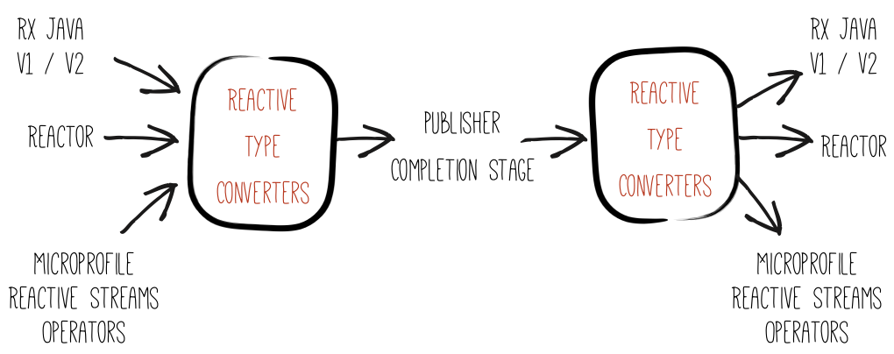

= Reactive Converters

The reactive type converters are a set of modules that can convert reactive types from different reactive programming libraries.
The main interface is:

[source, java]
----
public interface ReactiveTypeConverter<T> {

    <X> CompletionStage<X> toCompletionStage(T instance);

    <X> Publisher<X> toRSPublisher(T instance);

    <X> T fromCompletionStage(CompletionStage<X> cs);

    <X> T fromPublisher(Publisher<X> publisher);

    // ...
----

You can use converters to convert types provided by different reactive programming libraries to `Publisher` and `CompletionStage`, and the opposite:

You can use converters to convert types provided by different reactive programming libraries to `Publisher` and
`CompletionStage`, and the opposite:

To use the converter you need:

1. Add the converter api dependency:
+
[source,xml]
----
<dependency>
  <groupId>io.smallrye.reactive</groupId>
  <artifactId>smallrye-reactive-converter-api</artifactId>
  <version>{last.version}</version>
</dependency>
----

2. For each reactive programming, add the associated dependency:
+
[source,xml,subs=attributes+]
----
<dependency>
    <groupId>io.smallrye.reactive</groupId>
    <artifactId>smallrye-reactive-converter-reactive-streams-operators</artifactId>
     <version>{last.version}</version>
</dependency>

<dependency>
    <groupId>io.smallrye.reactive</groupId>
    <artifactId>smallrye-reactive-converter-mutiny</artifactId>
    <version>{last.version}</version>
</dependency>

<dependency>
    <groupId>io.smallrye.reactive</groupId>
    <artifactId>smallrye-reactive-converter-reactor</artifactId>
    <version>{last.version}</version>
</dependency>

<dependency>
    <groupId>io.smallrye.reactive</groupId>
    <artifactId>smallrye-reactive-converter-rxjava1</artifactId>
    <version>{last.version}</version>
</dependency>

<dependency>
    <groupId>io.smallrye.reactive</groupId>
    <artifactId>smallrye-reactive-converter-rxjava2</artifactId>
    <version>{last.version}</version>
</dependency>

<dependency>
    <groupId>io.smallrye.reactive</groupId>
    <artifactId>smallrye-reactive-converter-rxjava3</artifactId>
    <version>{last.version}</version>
</dependency>
----

3. In your code, lookup for a converter and apply the conversion. For instance:
+
[source,java]
----
CompletionStage cs = ...
ReactiveTypeConverter<Completable> converter = Registry.lookup(Completable.class)
    .orElseThrow(() -> new AssertionError("Completable converter should be found"));
Completable converted = converter.fromCompletionStage(cs);
----

The conversion rules are detailed in the JavaDoc.
